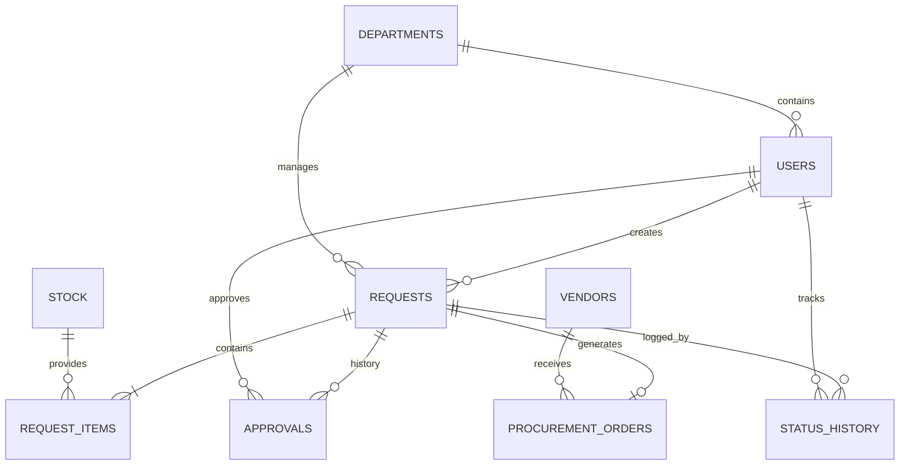
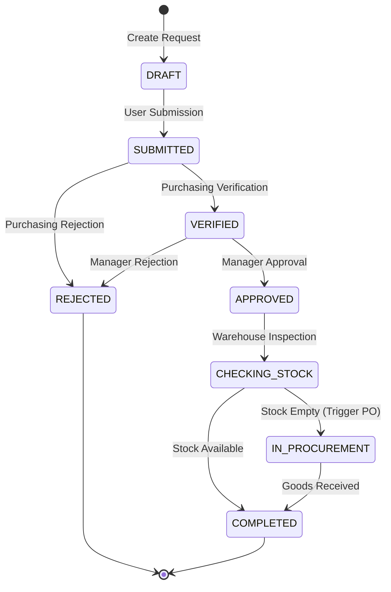

# 🛠️ Backend Technical Submission: Internal Procurement System

This document outlines the technical design, architectural decisions, and requirement analysis for the **Internal Procurement System**.

---

## 1. Requirement Analysis (20%)

### 1.1 Actor Identification
-   **Karyawan (Requester):** Initiates equipment/service requests.
-   **Purchasing Staff:** Verifies requests and initiates procurement from vendors.
-   **Atasan Purchasing:** Reviews (Approve/Reject) verified requests.
-   **Warehouse Staff:** Confirms stock availability.
-   **System:** Handles automated notifications and status transitions.

### 1.2 Core Entities
-   **User / Department:** Organizational structure.
-   **Request / Request_Item:** Transactional header and line items.
-   **Stock:** Catalog/Inventory tracking.
-   **Vendor:** Supplier management.
-   **Procurement_Order:** External purchase orders for replenishing stock.
-   **Status_History:** Immutable audit trail for all transitions.

### 1.3 Workflow States
`DRAFT` → `SUBMITTED` → `VERIFIED` → `APPROVED` → `REJECTED` → `CHECKING_STOCK` → `IN_PROCUREMENT` → `COMPLETED`

### 1.4 Critical Business Rules
-   `IN_PROCUREMENT` process is only triggered if stock is insufficient after approval.
-   Requester cannot modify a request once it has passed the `SUBMITTED` state.
-   Every status change must be logged for audit purposes.

### 1.5 Clarifications & Assumptions
-   **Partial Fulfillment:** Assumed that if stock is partially available, the request will wait until full procurement is completed or split into multiple deliveries (clarification needed).
-   **Approval Thresholds:** Assumed a single level of supervisor approval for simplicity in this scope.
-   **Notifications:** Assumed to be asynchronous via background queues (Laravel Queues + Redis).

---

## 2. System Design (30%)

### 2.1 Entity Relationship Diagram (ERD)

### 2.2 Design Rationale
-   **Normalization (3NF):** Ensuring data integrity by separating master data from transaction details.
-   **Snapshotting:** `snapshot_price` in `request_items` prevents history changes when master stock prices are updated later.
-   **Soft Deletion:** Used for all transactional data to ensure auditability and data recovery (regulatory compliance).
-   **Indexing:** Primary indexes on status and foreign keys to optimize frequent lookups and joins.

---

## 3. Workflow & Business Logic (20%)

### 3.1 State Transition Diagram

### 3.2 Concurrency & Integrity
-   **Pessimistic Locking:** Using `SELECT ... FOR UPDATE` in PostgreSQL to handle double approvals and race conditions in critical state transitions.
-   **Optimistic Locking:** Using `updated_at` versioning to handle parallel modifications of a request header by different users.
-   **Atomic Updates:** Using SQL-level decrements (e.g., `decrement('quantity', $qty)`) to prevent stock race conditions without needing complex application locks.

---

## 4. API Design (15%)

| Method | Endpoint | Description | Key Validation |
| :--- | :--- | :--- | :--- |
| **POST** | `/requests` | Create New Request | Items array required, Stock exists. |
| **GET** | `/requests?status=...` | List Requests | Filtering by enum statuses. |
| **POST** | `/requests/{id}/approve` | Manager Approval | State must be `VERIFIED`. |
| **POST** | `/requests/{id}/reject` | Manager Rejection | Requires `rejection_reason`. |
| **POST** | `/requests/{id}/procure` | Trigger PO | State must be `APPROVED` or `CHECKING_STOCK`. |

---

## 5. Reporting & Query (10%)
*Full SQL script available in `schema_and_queries.sql`.*

---

## 6. Advanced Engineering (5%)

-   **Optimization at Scale (5M Records):** 
    -   Implementation of **Read/Write Replicas** for database scaling. 
    -   **Time-based Partitioning** for the `requests` and `status_history` tables (partitioning by year).
    -   **Incremental Archiving** (Cold Storage) for completed/rejected records older than 2 years.
-   **Caching Strategy:** Using **Redis** to cache static master data (Departments, Categories) and dashboard reports with a short TTL.
-   **Audit Trail:** Implementing **Event Sourcing** patterns or strictly controlled append-only tables for `status_history`.
-   **Microservices:** Transitioning towards an Event-Driven architecture (Kafka/RabbitMQ) where Inventory, User, and Procurement are separate services.

---

**Estimated Time for Implementation:** 12–16 Hours (Backend Only).
**PostgreSQL Version:** 14
